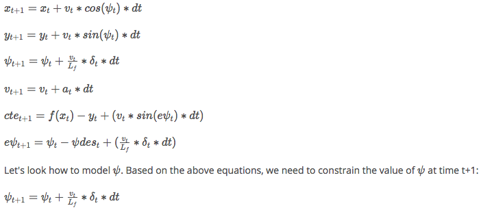

#MPC project

Purpose of the project is to design  model predict controller which uses
equations of motion to model the movement of a vehicle, predict where the vehicle
will be in the next N points(way points) in the future and adjust the speed and
angle such that the vehicle drives follows these way points to a  close degree and goes
around the lake without issues. This solution should work assuming there is a
100 ms of latency to simulate a real world application

##The model

The model takes into consideration the vehicles x and y co-ordinates, the
orientation psi, velocity , psi-error and cross-track-error (CTE). The actuator
provides acceleration and delta steering angles. The model uses the above
mentioned parameters, the previous state and the actuations from previous
timestamps to calculate the current state

The below equations are used to implement the model

##Values of dt and N chosen

Experimented with [N,dt] of [0.05,20] and [0.01 and 40]. In case 1, the model
becaume erratice and oscillatory. Case 2 went off the bridge. The values of
[10,0.1] was suggested in the walk-through video and it seemed to work

##Polynomial Fitting

The way points are transformed into co-ordinate system of the vehicle (
main.cpp: 104 ) so that the vehicle is always at the origin and the orientation
is wrt the vehicle. Fitting a polynomial becomes easier with this change

## Dealing with Latency

A latency of 100 ms is assumed. In case of 0 latency, the model depends on actuator ouputs
of previous time stamp. But with a 100 ms latency, the actuations are applied one more time step later (time step is
100ms) (MPC.cpp 99:108).
